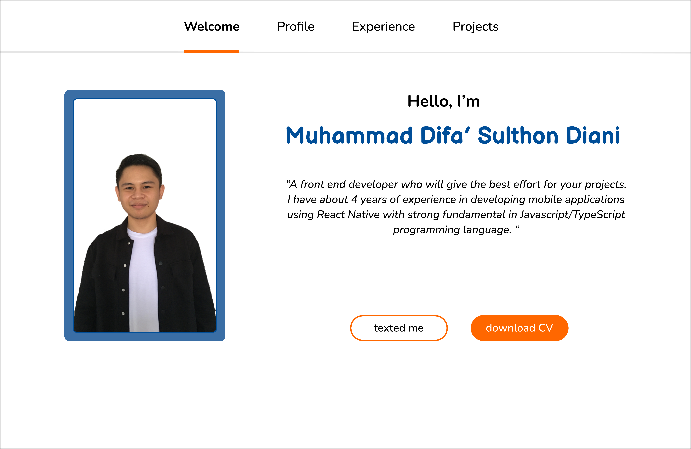

# Difa Sulthon's Personal Website

Here is my current personal website. This website contains various information about my background and profile during my career in the Information Technology industry. Built using html,css, and javascript and created by myself. This website has several features that you can use to get information such as home, profile, and portfolio. You can also enjoy the features available to connect directly with me.

## Feature

| **Page**       | **Detail**                                                                                                                                            |
| :------------- | :---------------------------------------------------------------------------------------------------------------------------------------------------- |
| **Welcome**    | Welcome page includes an introduction and help button to connect directly.                                                                            |
| **Profile**    | Profile page contains detailed information about me including educational background and help buttons to get to know me through several social media. |
| **Experience** | Experience page contains brief information about professional experience during career.                                                               |
| **Projects**   | Projects page contains some projects that I have contributed to.                                                                                      |

## User Interface

This is an example of how this website looks like. This is the welcome page.

## Design

You can see the full design through [this link.](https://www.figma.com/design/CQ9EnK6lsBx3GyCpFEy8as/difasulthon.com?node-id=6-2&t=iLQ0SF3TC2NMO3fH-0)
